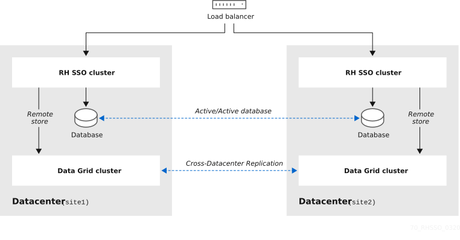

== Cross-Datacenter Replication Mode

### Prerequisites
As this is an advanced topic, we recommend you first read the following, which provide valuable background knowledge:

Clustering with Red Hat Single Sign-On When setting up for Cross-Datacenter Replication, you will use more independent Red Hat Single Sign-On clusters, so you must understand how a cluster works and the basic concepts and requirements such as load balancing, shared databases, and multicasting.
JBoss Data Grid Cross-Datacenter Replication Red Hat Single Sign-On uses JBoss Data Grid (JDG) for the replication of Infinispan data between the data centers.

# WIP
